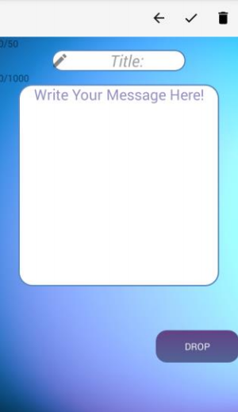
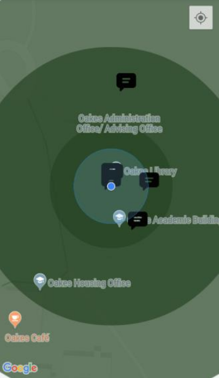

# Stibble
> An Android app that allows users to read and write virtual geographic-tied messages.

## Table of contents
* [Motivation](#motivation)
* [General Info](#general-info)
* [Screenshots](#screenshots)
* [Setup](#setup)
* [Contact](#contact)

## Motivation
The motivation behind this app was to replicate [Orange Guidance Soapstone messages](https://darksouls.fandom.com/wiki/Messages) as they work in the popular action role playing game [dark souls](https://en.wikipedia.org/wiki/Dark_Souls). 

In the game, players can leave short messages anywhere on the ground and they appear when another player gets close enough to the location where the messages was written.

## General info
Stibble attempts to mimic this functionality by allowing users to write messages that appear on a google map when another user gets close enough. Messages can be rated by other users using a +1/-1 system with ratings either prolonging or decreasing the lifetime of the message.  

## Screenshots
Writing a message:

How surrounding messages appear when scanning map:

How messages appear when clicked on:

## Setup
To manually install app follow instructions given [here](https://developer.android.com/training/basics/firstapp/running-app)

## Contact
Created by [kcharellano](https://www.linkedin.com/in/kcharellano/) - feel free to reach out!
